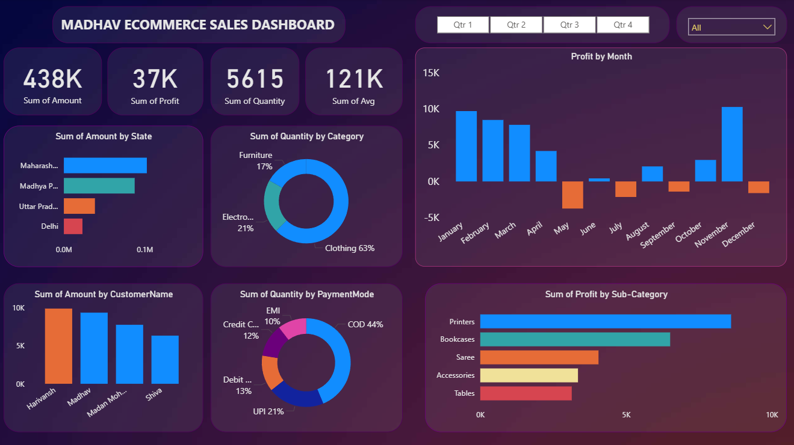

# 📊 Madhav Ecommerce Sales Dashboard (Power BI)

## 📌 Project Overview
This interactive Ecommerce Sales Dashboard was built using Power BI to analyze sales performance, profit trends, quantity distribution, and customer insights.

---

## 🎯 Objectives
- Analyze total sales, profit, and quantity
- Track monthly profit trends
- Understand state-wise sales performance
- Identify top-performing product sub-categories
- Analyze payment mode distribution

---

## 📊 Key Metrics
- 💰 Total Sales: 438K
- 📈 Total Profit: 37K
- 📦 Total Quantity: 5615
- 📊 Average Sales: 121K

---

## 📷 Dashboard Preview

---

## 🛠 Tools Used
- Power BI
- DAX
- Data Modeling
- Excel Dataset

---

## 🔍 Key Insights
- Maharashtra contributes highest revenue
- Clothing category dominates with 63%
- COD is the most used payment method
- Mid-year months show lower profit trends
- Printers and Bookcases generate high profit

---

## 👨‍💻 Author
Ankith I N  
Final Year BE | Data Analyst
